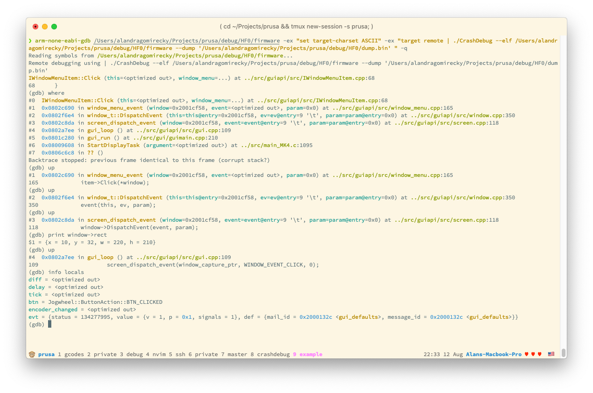

# CrashDebug

This is an utility meant for exploring crash dumps made by the Buddy firmware.
It is a fork of https://github.com/adamgreen/CrashDebug adding support for Buddy's Crash Dump files.

## How to use it

1. Prerequisites (Windows)

    * __bash__ - Git bash is OK.
    * __mingw__ - gcc and g++ are needed. Don't forget to add the bin folder into your path
    * __make__
        * Go to [ezwinports](https://sourceforge.net/projects/ezwinports/files/).
        * Download `make-4.1-2-without-guile-w32-bin.zip` (get the version without guile).
        * Extract zip.
        * Copy the contents to your mingw64 folder (either Git or previously installed; e.g.`c:\Program Files\Git\mingw64\`).
            Merge the folders, but do NOT overwrite/replace any existing files. 

        Steps copied from [evanwill](https://gist.github.com/evanwill/0207876c3243bbb6863e65ec5dc3f058#make)

1. Clone this repository

    ```sh
    git clone git@github.com:prusa3d/CrashDebug.git
    cd CrashDebug
    git submodule update --init --recursive
    ```

1. Build the project

    ```sh
    make CrashDebug
    ```

1. Collect the dump file (`.bin`) and appropriate ELF file (build product with no extension; ELF files are archived by Holly - holly.prusa3d.com).

    ```sh
    ❯ ls another_bsod_investigation
    dump.bin firmware
    ```

1. Start the debugger with your ELF file and the crash dump.

    ```sh
    arm-none-eabi-gdb <ELF FILE> \
        -ex "set target-charset ASCII" \
        -ex "target remote | ./CrashDebug --elf <ELF FILE> --dump <DUMP FILE> "
    ```

    > In case you don't have arm-none-eabi-gdb globally installed, you can use the one automatically bootstrapped by Buddy's build system (within the .dependecies folder).

    Example:

    ```sh
    arm-none-eabi-gdb ./another_bsod_investigation/firmware \
        -ex "set target-charset ASCII" \
        -ex "target remote | ./CrashDebug --elf ./another_bsod_investigation/firmware --dump ./another_bsod_investigation/dump.bin"
    ```

1. Use GDB to investigate the problem! 🎉

    
